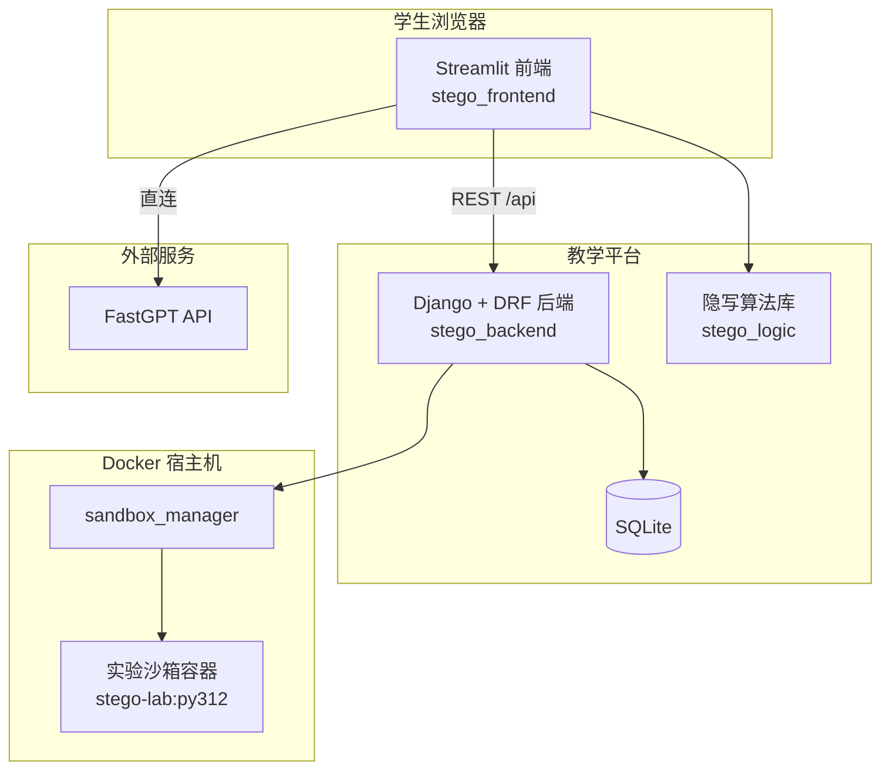

# 信息隐藏教学平台

面向《信息隐藏》课程的教学与实验平台，集成 **AI 助教问答**、**交互式隐写实验**、**Docker 实验沙箱** 与 **学情记录**，支持学生自主学习与教师后台管理。

## 功能概览

| 模块 | 说明 |
|------|------|
| **用户与权限** | 学生注册/登录（Token 鉴权）；扩展用户模型含学号、专业、年级；超级管理员可管理用户 |
| **AI 助教** | 基于 [FastGPT](https://fastgpt.io/) 的对话式助教，绑定课程知识库；支持多会话、历史消息与引用来源展示 |
| **实验台** | 空域 LSB、频域 DCT 隐写实验（上传载体图、嵌入/提取、可视化与自动存档）；「AI 水印检测」通过独立沙箱容器承载扩展实验 |
| **实验沙箱** | 每用户隔离的 Docker 容器（资源限额、独立网络）；启动/停止/状态查询；实验完成后空闲自动关箱 |
| **学情记录** | 保存载体/隐写图、PSNR、直方图与位平面数据、提取文本、CPU/内存与耗时等指标；支持筛选、导出 CSV |
| **管理监控** | 管理员查看全局沙箱运行、实时资源占用、强制停止异常容器 |

## 系统架构



- **前端**：Streamlit 多页面应用（首页、AI 助教、实验台、用户管理）。
- **后端**：Django REST Framework 提供认证、聊天会话、沙箱与实验记录 API。
- **算法**：`stego_logic` 封装 LSB / DCT 核心逻辑，供实验页直接调用。
- **沙箱**：后端通过 Docker SDK 为每位学生启动独立容器；Django 服务需挂载 `docker.sock`（见 `docker-compose.yml`）。

## 目录结构

```text
.
├── stego_backend/              # Django 后端
│   ├── manage.py
│   ├── sandbox_manager.py      # 实验沙箱生命周期管理
│   ├── sandbox.Dockerfile      # 沙箱镜像定义
│   ├── stego_backend/          # 项目配置（settings、urls）
│   └── users/                  # 用户、会话、沙箱、实验记录模型与 API
├── stego_frontend/             # Streamlit 前端
│   ├── app.py                  # 首页入口
│   ├── pages/                  # 子页面（AI 助教、实验台、用户管理）
│   ├── modules/                # 认证、品牌、AI 聊天等模块
│   └── image/                  # 站点 Logo 等资源
├── stego_logic/                # 隐写算法（LSB、DCT）
├── test/                       # AI 问答与沙箱压测脚本（见 test/README.md）
├── docker-compose.yml          # 一键启动 Django + Streamlit
└── requirements.txt
```

## 环境要求

- **Docker Desktop**（或可用的 Docker Engine）：实验沙箱与推荐部署方式均依赖 Docker。
- **Python 3.11+**（本地开发时）。
- **FastGPT API Key**：AI 助教功能所需（可在 [FastGPT 云](https://cloud.fastgpt.io/) 获取）。

## 快速启动（Docker 推荐）

在项目根目录执行：

```bash
docker compose up --build
```

首次启动会自动执行数据库迁移。访问地址：

| 服务 | 地址 |
|------|------|
| 教学前端（Streamlit） | http://localhost:8501 |
| 后端 API | http://localhost:8000/api |
| Django Admin | http://localhost:8000/admin |

### 配置 FastGPT

在启动前设置环境变量（PowerShell 示例）：

```powershell
$env:FASTGPT_API_KEY = "你的 FastGPT API Key"
docker compose up --build
```

或在项目根目录创建 `.env` 文件供 Compose 读取：

```env
FASTGPT_API_KEY=你的_FastGPT_API_Key
```

### 创建管理员

进入 Django 容器或本地环境后执行：

```bash
python stego_backend/manage.py createsuperuser
```

超级管理员登录 Streamlit 后可进入 **用户管理**，并在 **实验台** 查看全局沙箱监控。

> **说明**：`django` 服务已挂载 `/var/run/docker.sock`，用于在宿主机上创建实验容器。若沙箱启动失败，请确认 Docker 正在运行且 Compose 配置未被修改。

## 本地开发

1. 安装依赖：

```bash
pip install -r requirements.txt
```

2. 初始化数据库并启动后端：

```bash
python stego_backend/manage.py migrate
python stego_backend/manage.py runserver
```

3. 另开终端启动前端（需能访问后端 API 与 Docker）：

```bash
# Windows PowerShell
$env:PYTHONPATH = (Get-Location).Path
$env:DJANGO_API_BASE_URL = "http://127.0.0.1:8000/api"
$env:FASTGPT_API_KEY = "你的 FastGPT API Key"
streamlit run stego_frontend/app.py
```

本地实验沙箱同样要求本机 Docker 可用；后端进程需能访问 `docker.sock`（与生产 Compose 部署一致）。

## 环境变量

| 变量 | 使用方 | 说明 |
|------|--------|------|
| `DJANGO_API_BASE_URL` | Streamlit | 后端 API 根路径，默认 `http://django:8000/api`（Compose 内）或 `http://127.0.0.1:8000/api`（本地） |
| `FASTGPT_API_KEY` | Streamlit | FastGPT 鉴权密钥 |
| `FASTGPT_BASE_URL` | Streamlit | FastGPT API 地址，默认 `https://cloud.fastgpt.io/api` |
| `PYTHONPATH` | Streamlit | 设为项目根目录，以便 `import stego_frontend`、`import stego_logic` |

## 实验说明

### 空域 LSB 隐写

- 在载体图 RGB 最低有效位嵌入 UTF-8 文本（32 bit 长度头 + 载荷）。
- 实验台提供：容量估算、嵌入/提取校验、**PSNR**、灰度直方图对比、**8 位位平面**交互分解、结果自动写入实验记录。

### 频域 DCT 隐写

- 8×8 分块 DCT，在中频系数 `(3,4)` 上按量化步长嵌入比特。
- 额外支持 **JPEG 压缩**、**高斯噪声** 等鲁棒性攻击仿真及攻击后提取对比。

### 实验沙箱

- 镜像：`stego-lab:py312`（基于 `python:3.12-slim`，预装 OpenCV、SciPy、stegano、NumPy 等）。
- 每用户同时仅允许一个运行中沙箱；容器限制约 **512MB 内存**、**0.5 CPU**。
- 实验记录保存后若 **5 分钟**内无新操作，将自动停止当前用户沙箱以释放资源。

### AI 助教

- 对接 FastGPT 工作流与课程知识库，回答内容可展示 **引用片段**（PDF 章节来源）。
- 会话与消息持久化在后端，支持侧边栏切换历史会话。

## 主要 API（`/api`）

| 路径 | 方法 | 说明 |
|------|------|------|
| `auth/register` | POST | 注册 |
| `auth/login` | POST | 登录，返回 Token |
| `auth/logout` | POST | 退出 |
| `auth/me` | GET | 当前用户信息 |
| `users` | GET/POST | 用户列表/创建（管理员） |
| `users/<id>` | GET/PATCH/DELETE | 用户详情（管理员） |
| `chat/sessions` | GET/POST | AI 会话列表/创建 |
| `chat/sessions/<id>/messages` | GET/POST | 会话消息 |
| `labs/sandbox/start` | POST | 启动实验沙箱 |
| `labs/sandbox/stop` | POST | 停止沙箱 |
| `labs/sandbox/status` | GET | 当前用户沙箱状态与资源采样 |
| `labs/records` | GET/POST | 实验记录列表/提交 |
| `labs/records/export` | GET | 导出 CSV（管理员） |
| `labs/sandbox/admin/runs` | GET | 全局沙箱记录（管理员） |
| `labs/sandbox/admin/metrics` | GET | 运行中容器资源监控（管理员） |

认证方式：请求头 `Authorization: Token <token>`。

## 测试与评测

`test/` 目录提供自动化脚本，详见 [test/README.md](test/README.md)：

- **`run_ai_cases.py`**：批量执行 AI-01～AI-16 用例，统计通过率、领域外拒答率、引用命中率等。
- **`run_sandbox_benchmark_cli.py`**：沙箱并发压测（CPU/内存/启动耗时）。

## 技术栈

- **后端**：Django 5、Django REST Framework、Token 认证、SQLite
- **前端**：Streamlit、Plotly、Pillow
- **算法**：NumPy、OpenCV（`opencv-python-headless`）、PIL
- **基础设施**：Docker SDK、Docker Compose

## 生产部署注意

当前 `settings.py` 中 `DEBUG=True`、`SECRET_KEY` 为开发默认值，**上线前请务必**：

- 更换 `SECRET_KEY` 并关闭 `DEBUG`
- 配置 `ALLOWED_HOSTS` 与 HTTPS 反向代理
- 将 SQLite 替换为 PostgreSQL/MySQL 等（高并发场景）
- 通过环境变量或密钥管理服务注入 `FASTGPT_API_KEY`，勿将密钥提交到版本库

## 许可证

本项目为课程教学用途。第三方服务（FastGPT）的使用须遵守其服务条款。

## 项目声明

- 项目名称:信息隐藏教学平台
- 项目作者:ChungWaNamYeong 李佳霖
- 作者单位:暨南大学网络空间安全学院
- 开发语言:Python
- 框架:Django+Streamlit
- 核心技术:RAG、Docker、信息隐藏算法
